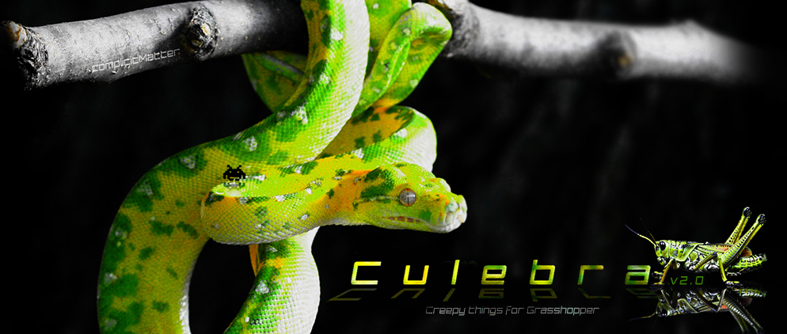

# Culebra
Culebra is a live agent based C# library and plugin for Grasshopper. It contains multiple behaviors in 2D/3D, mesh attraction and repulsion, as well as a self organization system for curve networks or trail outputs. The outputs can be optimized for simulation performance and changed to higher resolution presentation settings.
