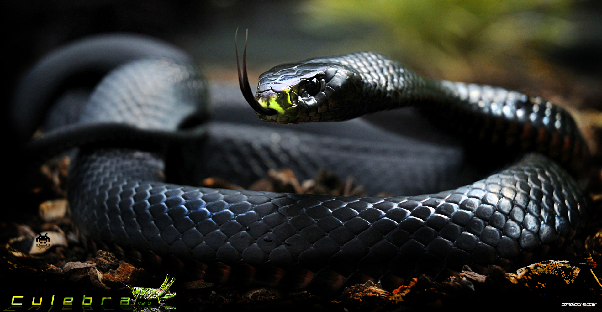

### CULEBRA.NET LIBRARY FOR RHINO/GH INTRODUCTION ###
Culebra.NET is a 2D|3D Multi Object Behavior library written in C# ([Wrapper around Culebra Java library](https://github.com/elQuixote/Culebra_Java)) focused on hybrid system interactions with custom Visualization, Data, and performance features. It contains a collection of objects and behaviors for creating dynamic multi agent interactions. For more information see the [Culebra Java Library](https://github.com/elQuixote/Culebra_Java).

--------------------------------------------------------------

### WAYS TO USE CULEBRA ###
### Pre-compiled binaries ###
The Culebra 2.1 installer will install both the core library <code>CulebraData.dll</code>, and the Grasshopper assembly <code>Culebra_2.1_GH.GHA</code>, into the <code>%appdata%\Roaming\Grasshopper\Libraries\Culebra_GH folder</code>. Do not forget to unblock the assemblies and Rhino will need to be restarted if you are already running it. 

* Visual Studio – Use the Culebra Objects and Controller through the use of the <code>CulebraData.dll</code> (Recommended)
* Visual Studio – Create your own objects and simply implement behavior classes individually. 
* Visual Studio – Create your own objects and inherit from Culebra Objects. This will provide access to the controller and all classes, through the use of the <code>CulebraData.dll</code>
* Grasshopper Scripting Components in C#,Python – Unavailable in Beta Release, currently some issues with <code>IKVM.JDK.Core.dll</code> in GH scripting environment

### IVKM Dependencies ###
IKVM.NET is an implementation of Java for [Mono](http://www.mono-project.com/) and the [Microsoft.NET Framework](https://www.microsoft.com/net). It includes the following components:
* A Java Virtual Machine implemented in .NET
* A .NET implementation of the Java class libraries
* Tools that enable Java and .NET interoperability

The IKVMC tool generates .NET assemblies from Java jar files. It converts Java bytecode to .NET dll's. The <code>culebra.dll</code> was created this was from the <code>culebra.jar</code> library and will be automatically installed in your <code>%appdata%\Roaming\Grasshopper\Libraries\Culebra_GH</code> folder along with all of the required IKVM dependecies by the Culebra 2.1 installer.

### Building from Source ###
If you wish to contribute to the project you will need to compile Culebra on your own system. Culebra.NET is built against .NET 4.0 so you will need to use Visual Studio 2010 or later. To resolve dependencies simply drop your <code>Rhinocommon.dll</code>, <code>Grasshopper.dll</code>, <code>GH_IO.dll</code> into the libs/ folder. The required dependencies below will be included in the libs folder so you should not have to search for them.  
* core.dll
* culebra.dll
* toxiclibscore.dll 
* IKVM.OpenJDK.Core.dll 
* Grasshopper.dll (need to add your own inside libs folder)
* Rhinocommon.dll (need to add your own inside libs folder)
* GH_IO.dll (need to add your own inside libs folder)

The visual studio solution includes 2 projects:
* Culebra_GH (update the build path to your <code>%appdata%\Roaming\Grasshopper\Libraries\Culebra_GH folder</code>)
* CulebraData
If you specify a different build path for your Culebra_GH project then you must replace the <code>CulebraData.dll</code> and the <code>Culebra_2.1_GH.gha</code> in your <code>%appdata%\Roaming\Grasshopper\Libraries\Culebra_GH folder</code>

--------------------------------------------------------------

### CULEBRA 2.1 GHA (GRASSHOPPER PLUGIN) ###
The Culebra grasshopper plugin was rewritten to implement a slew of new behaviors through the use CulebraData.dll which is a wrapper around the Culebra Java Library.

Version 2.1 Release include
* Wandering Behaviors
* Path Following Behaviors
* Multi.Objects Interactions
* Mesh Crawling Behaviors
* Stigmergy Behaviors
* Mesh Color Behavior Influence
* Graphics/Geometry Modes
* Visualization Features
* Single & Multi.Object Engines
* Zombie Engine
* Behavior Chaining with Controller

--------------------------------------------------------------

### BEHAVIORS ###
#### There are 7 Major Types of Behaviors which can be hybridized anyway your heart desires. ####
* Flocking Behavior - Flockers Behavior Type Class Implements Flock Behavior Interface
* Wandering Behavior - Wanderer Behavior Type Class Implements Wander Behavior Interface, the base Wander behavior is from Craig Reynolds and Daniel Shiffman.
* Noise Behavior - Improved Perlin Noise Behavior Type Class Implements Noise Behavior Interface. 
* Tracking Behavior - Path, Shape and multiShape Tracker Behavior Type Class Implements Tracking Behavior Interface. 
* BabyMakers Behavior - Objects can spawn children under the right conditions. Objects can have type specific behaviors. For example, if you are a "Parent" object or object of type Creeper or Seeker or you derrive from these classes then you can create children, however if you are of type BabyX then you no longer have the capability to spawn children.
* Mesh Crawler - Mesh Crawler Behavior Class. 
* Forces – Attract, Repel and other force methods inside the controller class.
#### The Controller ####
* Controller Class - this is the class which acts as controller for all behaviors classes. This class also builds on behaviors, using image drivers and other features which are not in the stock behavior classes. See Java Class Diagram for more details.

--------------------------------------------------------------

### RELEASES ###

#### Culebra 2.1 Release – Was built for Rhino/Grasshopper 7 & below ####
* View the [Installation Notes](http://culebra.technology/Culebra_2.0_InstallationNotes.pdf) and [Culebra 2.1 GH User Guide](http://culebra.technology/Culebra_2.0_UserGuide.pdf)
* [Download Culebra.NET Library Documentation](http://culebra.technology/Culebra_LibraryDocs.zip) 
* [Download Culebra 2.1 GH Demo Files](http://culebra.technology/Culebra_DemoFiles.zip) 
* [Download Culebra 2.1 Release](http://www.food4rhino.com/app/culebra) 

#### For more specific details see the Class Diagram Below ####

--------------------------------------------------------------

### JAVA CLASS DIAGRAMS ###

### CREDITS ###

* Thanks to Craig Reynolds for all of his work on boid behavior
* Big thanks to Daniel Shiffman, his work has been very inspirational and referenced in this library.
* Thanks to David Rutten for all of the custom component attributes used to generate the component colors
